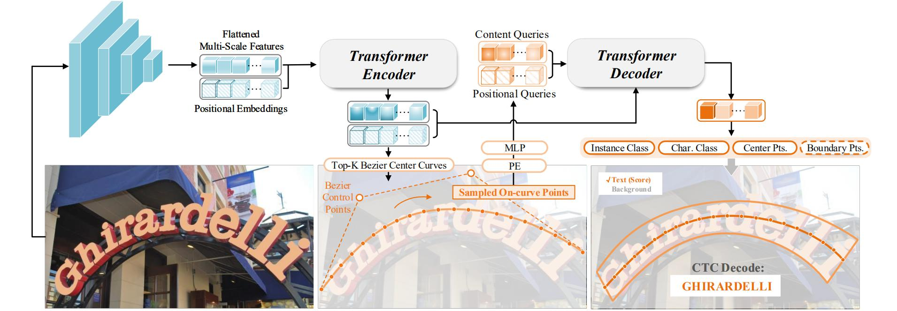

<h1 align="center">DeepSolo: Let Transformer Decoder with Explicit Points Solo for Text Spotting</h1> 

<p align="center">
  <a href="#News">News</a> |
  <a href="#Main Results">Main Results</a> |
  <a href="#Usage">Usage</a> |
  <a href="#Citation">Citation</a> |
  <a href="#Acknowledgement">Acknowledgement</a>
</p >
This is the official repo for the papers:

> [**DeepSolo: Let Transformer Decoder with Explicit Points Solo for Text Spotting**](https://arxiv.org/abs/2211.10772)
> 
> [**DeepSolo++: Let Transformer Decoder with Explicit Points Solo for Multilingual Text Spotting**](https://arxiv.org/abs/2305.19957)



## News

`2024.04.25` Update models finetuned on BOVText and DSText video datasets. 

`2023.06.2` Update the pre-trained and fine-tuned Chinese scene text spotting model (78.3% 1-NED on ICDAR 2019 ReCTS). 

`2023.05.31` The extension paper (DeepSolo++) is submitted to ArXiv. The code and models will be released soon.

`2023.02.28` DeepSolo is accepted by CVPR 2023. :tada::tada:

***

Relevant Project: 

> :sparkles: [**Hi-SAM: Marrying Segment Anything Model for Hierarchical Text Segmentation** ](https://arxiv.org/abs/2401.17904) | [Code](https://github.com/ymy-k/Hi-SAM)
> 
> :sparkles: [**GoMatching: A Simple Baseline for Video Text Spotting via Long and Short Term Matching** ](https://arxiv.org/abs/2401.07080) | [Code](https://github.com/Hxyz-123/GoMatching)
> 
> [**DPText-DETR: Towards Better Scene Text Detection with Dynamic Points in Transformer** ](https://arxiv.org/abs/2207.04491) | [Code](https://github.com/ymy-k/DPText-DETR)


Other applications of [ViTAE](https://github.com/ViTAE-Transformer/ViTAE-Transformer) inlcude: [ViTPose](https://github.com/ViTAE-Transformer/ViTPose) | [Remote Sensing](https://github.com/ViTAE-Transformer/ViTAE-Transformer-Remote-Sensing) | [Matting](https://github.com/ViTAE-Transformer/ViTAE-Transformer-Matting) | [VSA](https://github.com/ViTAE-Transformer/ViTAE-VSA) | [Video Object Segmentation](https://github.com/ViTAE-Transformer/VOS-LLB)


## Main Results

**Total-Text**
|Backbone|External Data|Det-P|Det-R|Det-F1|E2E-None|E2E-Full|Weights|
|:------:|:------:|:------:|:------:|:------:|:------:|:------:|:------:|
|Res-50|Synth150K|93.9|82.1|87.6|78.8|86.2|[OneDrive](https://1drv.ms/u/s!AimBgYV7JjTlgcd3oqq103k359L2PQ?e=tkxgol)|
|Res-50|Synth150K+MLT17+IC13+IC15|93.1|82.1|87.3|79.7|87.0|[OneDrive](https://1drv.ms/u/s!AimBgYV7JjTlgcd2FhvW7pjuKs4iLQ?e=TqYdjG)|
|Res-50|Synth150K+MLT17+IC13+IC15+TextOCR|93.2|84.6|88.7|$\underline{\text{82.5}}$|$\underline{\text{88.7}}$|[OneDrive](https://1drv.ms/u/s!AimBgYV7JjTlgcd138p8HaXViFk-tw?e=r15pMR)|
|Res-101|Synth150K+MLT17+IC13+IC15|93.2|83.5|88.1|80.1|87.1|[OneDrive](https://1drv.ms/u/s!AimBgYV7JjTlgcd0wgXgTNJg3lD4qQ?e=wuOPfN)|
|Swin-T|Synth150K+MLT17+IC13+IC15|92.8|83.5|87.9|79.7|87.1|[OneDrive](https://1drv.ms/u/s!AimBgYV7JjTlgcd5mc12FlChwGCUig?e=Xjdtis)|
|Swin-S|Synth150K+MLT17+IC13 +C15|93.7|84.2|88.7|81.3|87.8|[OneDrive](https://1drv.ms/u/s!AimBgYV7JjTlgcd4Rn_bg8cOn-LwEg?e=dVqz7z)|
|ViTAEv2-S|Synth150K+MLT17+IC13+IC15|92.6|85.5|$\underline{\text{88.9}}$|81.8|88.4|[OneDrive](https://1drv.ms/u/s!AimBgYV7JjTlgcd8dztVae7RRLn6Ow?e=2GLRAs)|
|ViTAEv2-S|Synth150K+MLT17+IC13+IC15+TextOCR|92.9|87.4|**90.0**|**83.6**|**89.6**|[OneDrive](https://1drv.ms/u/s!AimBgYV7JjTlgcd6XGlbZ-I7WvGslQ?e=rrkXLx)|

**ICDAR 2015 (IC15)**

|Backbone|External Data|Det-P|Det-R|Det-F1|E2E-S|E2E-W|E2E-G|Weights|
|:------:|:------:|:------:|:------:|:------:|:------:|:------:|:------:|:------:|
|Res-50|Synth150K+Total-Text+MLT17+IC13|92.8|87.4|90.0|86.8|81.9|76.9|[OneDrive](https://1drv.ms/u/s!AimBgYV7JjTlgcdp6_LjerVYzoYORw?e=0ZuXgR)|
|Res-50|Synth150K+Total-Text+MLT17+IC13+TextOCR|92.5|87.2|89.8|$\underline{\text{88.0}}$|$\underline{\text{83.5}}$|$\underline{\text{79.1}}$|[OneDrive](https://1drv.ms/u/s!AimBgYV7JjTlgcdonZXu6_JtW2QMuA?e=8BTzmi)|
|ViTAEv2-S|Synth150K+Total-Text+MLT17+IC13|93.7|87.3|**90.4**|87.5|82.8|77.7|[OneDrive](https://1drv.ms/u/s!AimBgYV7JjTlgcdrUOUheq2dw6FP-A?e=PYXbiY)|
|ViTAEv2-S|Synth150K+Total-Text+MLT17+IC13+TextOCR|92.4|87.9|$\underline{\text{90.1}}$|**88.1**|**83.9**|**79.5**|[OneDrive](https://1drv.ms/u/s!AimBgYV7JjTlgcdqw1UUnbSAG4qoWA?e=Co1prY)|

**CTW1500**

|Backbone|External Data|Det-P|Det-R|Det-F1|E2E-None|E2E-Full|Weights|
|:------:|:------:|:------:|:------:|:------:|:------:|:------:|:------:|
|Res-50|Synth150K+Total-Text+MLT17+IC13+IC15|93.2|85.0|88.9|64.2|81.4|[OneDrive](https://1drv.ms/u/s!AimBgYV7JjTlgcdsiFgSz-FHgKepqQ?e=56gdHj)|

**ICDAR 2019 ReCTS**
|Backbone|External Data|Det-P|Det-R|Det-H|1-NED|Weights|
|:------:|:------:|:------:|:------:|:------:|:------:|:------:|
|Res-50|SynChinese130K+ArT+LSVT|92.6|89.0|90.7|78.3|[OneDrive](https://1drv.ms/u/s!AimBgYV7JjTlgch2WG67htEhTddRnw?e=UpnEaq)|
|ViTAEv2-S|SynChinese130K+ArT+LSVT|92.6|89.9|91.2|79.6|[OneDrive](https://1drv.ms/u/s!AimBgYV7JjTlgclUYAOof4UpAxo1qw?e=y1VT42)|

***

**Pre-trained Models for Total-Text & ICDAR 2015**

|Backbone|Training Data|Weights|
|:------:|:------:|:------:|
|Res-50|Synth150K+Total-Text|[OneDrive](https://1drv.ms/u/s!AimBgYV7JjTlgcdxUY6EC18kIvb2HA?e=GSC8Cx)|
|Res-50|Synth150K+Total-Text+MLT17+IC13+IC15|[OneDrive](https://1drv.ms/u/s!AimBgYV7JjTlgcdwrhMu_5lyV3j3gg?e=90flAQ)|
|Res-50|Synth150K+Total-Text+MLT17+IC13+IC15+TextOCR|[OneDrive](https://1drv.ms/u/s!AimBgYV7JjTlgcdu018Hx6GHAo-ZCQ?e=NkEQt6)|
|Res-101|Synth150K+Total-Text+MLT17+IC13+IC15|[OneDrive](https://1drv.ms/u/s!AimBgYV7JjTlgcdvwoL7Y1PSlNFMgw?e=APocIV)|
|Swin-T|Synth150K+Total-Text+MLT17+IC13+IC15|[OneDrive](https://1drv.ms/u/s!AimBgYV7JjTlgcdzxsGdxKgUOoiIVA?e=7BxJhq)|
|Swin-S|Synth150K+Total-Text+MLT17+IC13+IC15|[OneDrive](https://1drv.ms/u/s!AimBgYV7JjTlgcdyjP6PtQSliVdJLA?e=hHkIs4)|
|ViTAEv2-S|Synth150K+Total-Text+MLT17+IC13+IC15|[OneDrive](https://1drv.ms/u/s!AimBgYV7JjTlgcd7KPBhro8LU9fLjA?e=gcpVZ2)|
|ViTAEv2-S|Synth150K+Total-Text+MLT17+IC13+IC15+TextOCR|[OneDrive](https://1drv.ms/u/s!AimBgYV7JjTlgcd9wi432uitMgTM-w?e=fjuJbm)|

**Pre-trained Model for CTW1500**

|Backbone|Training Data|Weights|
|:------:|:------:|:------:|
|Res-50|Synth150K+Total-Text+MLT17+IC13+IC15|[OneDrive](https://1drv.ms/u/s!AimBgYV7JjTlgcdtYzwEBGvOH6CiBw?e=trgKFE)|

**Pre-trained Model for ReCTS**

|Backbone|Training Data|Weights|
|:------:|:------:|:------:|
|Res-50|SynChinese130K+ArT+LSVT+ReCTS|[OneDrive](https://1drv.ms/u/s!AimBgYV7JjTlgch1pH08bolhgKEBQQ?e=yeSwwQ)|
|ViTAEv2-S|SynChinese130K+ArT+LSVT+ReCTS|[OneDrive](https://1drv.ms/u/s!AimBgYV7JjTlgclTt8LRiZd3yh_c9Q?e=qLhBYG)|

***

> for video datasets

Model finetuned on **[BOVText](https://github.com/weijiawu/BOVText-Benchmark)**:

|Backbone|Config|External Data|Weights|
|:------:|:------:|:------:|:------:|
|Res-50|`NUM_QUERIES`: 100, `NUM_POINTS`: 25, `VOC_SIZE`: 5462|SynChinese130K+ArT+LSVT+ReCTS|[OneDrive](https://1drv.ms/u/s!AimBgYV7JjTlgcskG1ZT6CA4jkz54g?e=ALadSW)|

Model finetuned on **[DSText ](https://rrc.cvc.uab.es/?ch=22)**:

|Backbone|Config|External Data|Weights|
|:------:|:------:|:------:|:------:|
|Res-50|`NUM_QUERIES`: 300, `NUM_POINTS`: 25, `VOC_SIZE`: 37|Synth150K+Total-Text+MLT17+IC13+IC15+TextOCR|[OneDrive](https://1drv.ms/u/s!AimBgYV7JjTlgcsmlIxE_M2822nI_g?e=4Dqyhs)|

**Pre-trained Model for DSText**

|Backbone|Config|Training Data|Weights|
|:------:|:------:|:------:|:------:|
|Res-50|`NUM_QUERIES`: 300, `NUM_POINTS`: 25, `VOC_SIZE`: 37|Synth150K+Total-Text+MLT17+IC13+IC15+TextOCR|[OneDrive](https://1drv.ms/u/s!AimBgYV7JjTlgcsoo1OYjqR-YiYq-Q?e=Wao9vV)|

## Usage

- ### Installation

Python 3.8 + PyTorch 1.9.0 + CUDA 11.1 + Detectron2 (v0.6)
```
git clone https://github.com/ViTAE-Transformer/DeepSolo.git
cd DeepSolo
conda create -n deepsolo python=3.8 -y
conda activate deepsolo
pip install torch==1.9.0+cu111 torchvision==0.10.0+cu111 -f https://download.pytorch.org/whl/torch_stable.html
pip install -r requirements.txt
python -m pip install detectron2 -f https://dl.fbaipublicfiles.com/detectron2/wheels/cu111/torch1.9/index.html
python setup.py build develop
```

- ### Preparation

<details>
<summary>Datasets</summary>

`[SynthText150K (CurvedSynText150K)]` [images](https://github.com/aim-uofa/AdelaiDet/tree/master/datasets) | [annotations(Part1)](https://1drv.ms/u/s!ApEsJ9RIZdBQgQTfQC578sYbkPik?e=2Yz06g) | [annotations(Part2)](https://1drv.ms/u/s!ApEsJ9RIZdBQgQJWqH404p34Wb1m?e=KImg6N)

`[MLT]` [images](https://github.com/aim-uofa/AdelaiDet/tree/master/datasets) | [annotations](https://1drv.ms/u/s!ApEsJ9RIZdBQgQBpvuvV2KBBbN64?e=HVTCab)

`[ICDAR2013]` [images](https://1drv.ms/u/s!ApEsJ9RIZdBQgQcK05sWzK3_t26T?e=5jTWAa) | [annotations](https://1drv.ms/u/s!ApEsJ9RIZdBQfbgqFCeiKOrTM0E?e=UMfIQh)

`[ICDAR2015]` [images](https://1drv.ms/u/s!ApEsJ9RIZdBQgQbupfCNqVxtYGna?e=b4TQY2) | [annotations](https://1drv.ms/u/s!ApEsJ9RIZdBQfhGW5JDiNcDxfWQ?e=PZ2JCX)

`[Total-Text]` [images](https://1drv.ms/u/s!ApEsJ9RIZdBQgQjyPyivo_FnjJ1H?e=qgSFYL) | [annotations](https://1drv.ms/u/s!ApEsJ9RIZdBQgQOShwd8O0K5Dd1f?e=GYyPAX)

`[CTW1500]` [images](https://1drv.ms/u/s!ApEsJ9RIZdBQgQlZVAH5AJld3Y9g?e=zgG71Z) | [annotations](https://1drv.ms/u/s!ApEsJ9RIZdBQfPpyzxoFV34zBg4?e=WK20AN)

`[TextOCR]` [images](https://dl.fbaipublicfiles.com/textvqa/images/train_val_images.zip) | [annotations](https://1drv.ms/u/s!ApEsJ9RIZdBQgQHY3mjH13GRLPGI?e=Dx1O99)

`[Inverse-Text]` [images](https://1drv.ms/u/s!AimBgYV7JjTlgccVhlbD4I3z5QfmsQ?e=myu7Ue) | [annotations](https://1drv.ms/u/s!ApEsJ9RIZdBQf3G4vZpf4QD5NKo?e=xR3GtY)

`[SynChinese130K]` [images](https://github.com/aim-uofa/AdelaiDet/tree/master/datasets) | [annotations](https://1drv.ms/u/s!AimBgYV7JjTlgch5W0n1Iv397i0csw?e=Gq8qww)

`[ArT]` [images](https://github.com/aim-uofa/AdelaiDet/tree/master/datasets) | [annotations](https://1drv.ms/u/s!AimBgYV7JjTlgch45d0VHNCoPC1jfQ?e=likK00)

`[LSVT]` [images](https://github.com/aim-uofa/AdelaiDet/tree/master/datasets) | [annotations](https://1drv.ms/u/s!AimBgYV7JjTlgch7yjmrCSN0TgoO4w?e=NKd5OG)

`[ReCTS]` [images](https://github.com/aim-uofa/AdelaiDet/tree/master/datasets) | [annotations](https://1drv.ms/u/s!AimBgYV7JjTlgch_xZ8otxFWfNgZSg?e=pdq28B)

`[Evaluation ground-truth]` [Link](https://1drv.ms/u/s!ApEsJ9RIZdBQem-MG1TjuRWApyA?e=fVPnmT)

*Some image files need to be renamed.* Organize them as follows (lexicon files are not listed here):

```
|- ./datasets
   |- syntext1
   |  |- train_images
   |  └  annotations
   |       |- train_37voc.json
   |       └  train_96voc.json
   |- syntext2
   |  |- train_images
   |  └  annotations
   |       |- train_37voc.json
   |       └  train_96voc.json
   |- mlt2017
   |  |- train_images
   |  |- train_37voc.json
   |  └  train_96voc.json
   |- totaltext
   |  |- train_images
   |  |- test_images
   |  |- train_37voc.json
   |  |- train_96voc.json
   |  └  test.json
   |- ic13
   |  |- train_images
   |  |- train_37voc.json
   |  └  train_96voc.json
   |- ic15
   |  |- train_images
   |  |- test_images
   |  |- train_37voc.json
   |  |- train_96voc.json
   |  └  test.json
   |- ctw1500
   |  |- train_images
   |  |- test_images
   |  |- train_96voc.json
   |  └  test.json
   |- textocr
   |  |- train_images
   |  |- train_37voc_1.json
   |  └  train_37voc_2.json
   |- inversetext
   |  |- test_images
   |  └  test.json
   |- chnsyntext
   |  |- syn_130k_images
   |  └  chn_syntext.json
   |- ArT
   |  |- rename_artimg_train
   |  └  art_train.json
   |- LSVT
   |  |- rename_lsvtimg_train
   |  └  lsvt_train.json
   |- ReCTS
   |  |- ReCTS_train_images  # 18,000 images
   |  |- ReCTS_val_images  # 2,000 images
   |  |- ReCTS_test_images  # 5,000 images
   |  |- rects_train.json
   |  |- rects_val.json
   |  └  rects_test.json
   |- evaluation
   |  |- gt_*.zip
```
</details>

<details>
<summary>ImageNet Pre-trained Backbone</summary>

If you want to pre-train DeepSolo with ResNet-101, ViTAEv2-S or SwinTransformer , you can download the converted backbone weights and put them under `pretrained_backbone` for initialization:  [Swin-T](https://1drv.ms/u/s!ApEsJ9RIZdBQgQvFeSphQrQyacmS?e=H7NtDN) | [ViTAEv2-S](https://1drv.ms/u/s!ApEsJ9RIZdBQgQqGMOhxm6SNmXu3?e=8hiqX1) | [Res101](https://1drv.ms/u/s!ApEsJ9RIZdBQgQ3594GtopQMe-lR?e=fPnWeb) | [Swin-S](https://1drv.ms/u/s!ApEsJ9RIZdBQgQzn8w4kPoPvzOtY?e=Hfa4ET). You can also refer to the python files in `pretrained_backbone` and convert the backbones by yourself.
</details>


If you want to use the model trained on Chinese data, please download the font (`simsun.ttc`) and Chinese character list (`chn_cls_list`, a binary file) first.
```
wget https://drive.google.com/file/d/1dcR__ZgV_JOfpp8Vde4FR3bSR-QnrHVo/view?usp=sharing -O simsun.ttc
wget https://drive.google.com/file/d/1wqkX2VAy48yte19q1Yn5IVjdMVpLzYVo/view?usp=sharing -O chn_cls_list
```

- ### Training
<details>
<summary>Total-Text & ICDAR2015</summary>

**1. Pre-train**

For example, pre-train DeepSolo with Synth150K+Total-Text+MLT17+IC13+IC15:

```
python tools/train_net.py --config-file configs/R_50/pretrain/150k_tt_mlt_13_15.yaml --num-gpus 4
```

**2. Fine-tune**

Fine-tune on Total-Text or ICDAR2015:

```
python tools/train_net.py --config-file configs/R_50/TotalText/finetune_150k_tt_mlt_13_15.yaml --num-gpus 4
python tools/train_net.py --config-file configs/R_50/IC15/finetune_150k_tt_mlt_13_15.yaml --num-gpus 4
```
</details>

<details>
<summary>CTW1500</summary>

**1. Pre-train**

```
python tools/train_net.py --config-file configs/R_50/CTW1500/pretrain_96voc_50maxlen.yaml --num-gpus 4
```

**2. Fine-tune**

```
python tools/train_net.py --config-file configs/R_50/CTW1500/finetune_96voc_50maxlen.yaml --num-gpus 4
```
</details>

<details>
<summary>ReCTS</summary>

**1. Pre-train**

```
python tools/train_net.py --config-file configs/R_50/ReCTS/pretrain.yaml --num-gpus 8
```

**2. Fine-tune**

```
python tools/train_net.py --config-file configs/R_50/ReCTS/finetune.yaml --num-gpus 8
```
</details>


- ### Evaluation
```
python tools/train_net.py --config-file ${CONFIG_FILE} --eval-only MODEL.WEIGHTS ${MODEL_PATH}
```
**Note:** To conduct evaluation on ICDAR 2019 ReCTS, you can directly submit the saved file `output/R50/rects/finetune/inference/rects_submit.txt` to the [official website](https://rrc.cvc.uab.es/?ch=12&com=mymethods&task=4) for evaluation.


- ### Visualization Demo
```
python demo/demo.py --config-file ${CONFIG_FILE} --input ${IMAGES_FOLDER_OR_ONE_IMAGE_PATH} --output ${OUTPUT_PATH} --opts MODEL.WEIGHTS <MODEL_PATH>
```

## Citation

If you find DeepSolo helpful, please consider giving this repo a star:star: and citing:
```bibtex
@inproceedings{ye2023deepsolo,
  title={DeepSolo: Let Transformer Decoder with Explicit Points Solo for Text Spotting},
  author={Ye, Maoyuan and Zhang, Jing and Zhao, Shanshan and Liu, Juhua and Liu, Tongliang and Du, Bo and Tao, Dacheng},
  booktitle={Proceedings of the IEEE/CVF Conference on Computer Vision and Pattern Recognition},
  pages={19348--19357},
  year={2023}
}

@article{ye2023deepsolo++,
  title={DeepSolo++: Let Transformer Decoder with Explicit Points Solo for Multilingual Text Spotting},
  author={Ye, Maoyuan and Zhang, Jing and Zhao, Shanshan and Liu, Juhua and Liu, Tongliang and Du, Bo and Tao, Dacheng},
  booktitle={arxiv preprint arXiv:2305.19957},
  year={2023}
}
```

## Acknowledgement

This project is based on [Adelaidet](https://github.com/aim-uofa/AdelaiDet). For academic use, this project is licensed under the 2-clause BSD License.